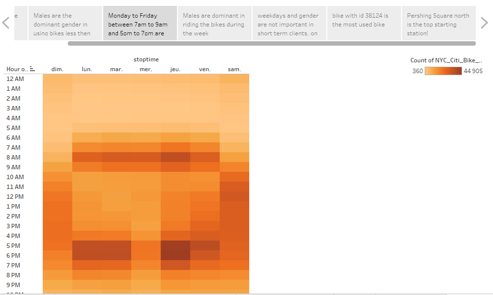

# bikesharing
An analysis of NYC CitiBike bikesharing data from August, 2019, with Tableau

## Overview
Here our story begins:

Before getting into the details of the above mentioned story, The framework for this project was to analyze bikeshare data from CitiBike in New York City for presentation to investors looking to begin a bikeshare program in Des Moines, Iowa. Even though, the two locations are quite different, analyzing the data over NYC, will help give insights and answer key questions!
- What gender uses the bikes most?
- What weekdays are the busiest?
- What bikes are to be repaired and what's the best time to repair them?

## Results

The dominant gender using the bikes are males followed by females and than others, although this isn't enough classification as the gender alone is not a key factor, as being a subscriber shows a regular usage of bikes against being a short term client.
Now before getting more in depth about this affects the income of the project, let's view the top starting stations with the station Pershing Square North being the first

The above map displays the bike stations from which recorded bike trips started. The size of the circles and darkness of the red indicate the relative number of trips started at those locations. It is apparent that the bulk of the bike trips are originating in the bustling commercial heart of Lower Manhattan, as it is the busiest area and the most entrainement offering. Bike usage is lower in the less densely packed surrounding neighborhoods.
